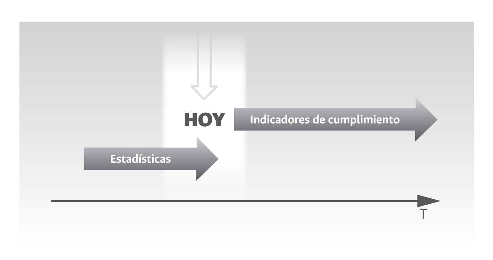

```{r setup, include=FALSE}
options(htmltools.dir.version = FALSE,  htmltools.preserve.raw = FALSE)
```

<!-- Uso de funcionalidades de xaringan extras -->

```{r xaringan-panelset, echo=FALSE}
xaringanExtra::use_panelset()
```

```{r xaringan-scribble, echo=FALSE}
xaringanExtra::use_scribble()
```

```{r xaringan-webcam, include = FALSE}
xaringanExtra::use_webcam()
```

```{r xaringan-logo, echo=FALSE}
xaringanExtra::use_logo(
  image_url = "https://raw.githubusercontent.com/estadisticaun/TendenciasCSU/master/Imagenes/LOGOSIMBOLO%20LATERAL.png", width = "115px",
  height = "133px")
```

<!-- INICIO DE LA PRESENTACIÓN -->

## Consideraciones para el uso adecuado de la presentación

  1.	<p style="font-size:100%  align="justify";> Dar click en la letra <b>H</b> o en el símbolo <b>?</b> para desplegar las distintas <b>opciones de navegación</b> que ofrece la presentación.</p>
  
  2.	<p style="font-size:100%  align="justify";> La opción <b>“Pantalla Completa”</b> presenta <b>problemas</b> en los <b>dispositivos móviles Iphone.</b></p>
  
  3.	<p style="font-size:100%  align="justify";> Si uno o más objetos gráficos presentan algún grado de desconfiguración/deformación, recargar las presentación dando click en la tecla  <b>F5</b> si nos encontramos en un PC o directamente desde la barra del navegador.</p>
  
  4.	<p style="font-size:100%"  align="justify";> La totalidad de gráficos interactivos tienen la opción de ser vistos en <b>pantalla completa</b> (full screen). Para hacer uso de esta opción, ir a la parte baja de cada gráfico o a los íconos ubicados en la parte superior derecha o izquierda de los mismos. Para salir de la opción pantalla completa, dar click en la tecla <b>ESC</b>.</p>
  
  5.	<p style="font-size:100%"  align="justify";> Buena parte de los gráficos contenidos en las distintas diapositivas pueden ser <b>“manipulados”</b> al hacer <b>click</b> en las distintas <b>opciones/etiquetas</b> que los acompañan.</p>

---
class: inverse, center, middle

# ¿Por qué es importante gestionar la información cuantitativa en las entidades públicas?

---
### ¿Por qué es importante gestionar la información cuantitativa?

.panelset[
.panel[.panel-name[1.Planeación]

.pull-left[
<br>
<br>
```{r figPla, fig.align='center', out.width='100%', fig.show='hold', echo=FALSE}
knitr::include_graphics('Imagenes/Planeacion.jpg')
```
]
.pull-right[
<br>

- <p align="justify"> <FONT COLOR="red"><u>Cifras/estadísticas</u></FONT> para la formulación de planes de desarrollo.

- <p align="justify"><FONT COLOR="red"><u>Indicadores</u></FONT> de seguimiento/cumplimiento de planes, programas y proyectos. 

- <p align="justify"><FONT COLOR="red"><u>Evaluación</u></FONT> del impacto de planes, programas y proyectos.

]
]

.panel[.panel-name[2.Gestión]

.pull-left[
<br>
<br>
```{r figGes, fig.align='center', out.width='100%', fig.show='hold', echo=FALSE}

```
]

.pull-right[
- <p align="justify">Gestión pública orientada por procesos y a través de lineamientos contenidos en normas estandarizadas tipo ISO. Por ejemplo, la experiencia de Colombia con la construcción e implementación de la **NTCPG 1000**.

- <p align="justify">Necesidad de contar con <FONT COLOR="red"><u>indicadores de gestión</u></FONT> por procesos.
]
]

.panel[.panel-name[3.Transparencia]

.pull-left[
<br>
<br>
```{r figTra, fig.align='center', out.width='100%', fig.show='hold', echo=FALSE}
knitr::include_graphics('Imagenes/Transparencia.jpg')
```
]

.pull-right[
<p align="justify">[LEY 1712 DE 2014](https://www.funcionpublica.gov.co/eva/gestornormativo/norma.php?i=56882). Por medio de la cual se crea la <u>Ley de Transparencia</u> y del Derecho de Acceso a la Información Pública Nacional

- **Artículo 11.** Literal d (disposición de <FONT COLOR="red"><u>indicadores de desempeño.</u></FONT>)

- **Artículo 11.** Literal k (publicación de <FONT COLOR="red"><u>datos abiertos.</u></FONT>)

<p align="justify">[LEY ESTATUTARIA 1581 DE 2012](https://www.funcionpublica.gov.co/eva/gestornormativo/norma.php?i=49981#:~:text=La%20presente%20ley%20tiene%20por,el%20art%C3%ADculo%2015%20de%20la). Protección de datos personales (*Habeas Data*).
]
]

.panel[.panel-name[4.Control/Autocontrol]

.pull-left[
<br>
<br>
```{r figCont, fig.align='center', out.width='100%', fig.show='hold', echo=FALSE}
knitr::include_graphics('Imagenes/Control.jpg')
```
]

.pull-right[

#### Control Externo

- Apuesta nacional por alcanzar un **control fiscal en tipo real**. 

- Disposición de bases de datos<FONT COLOR="red"><u> intercambio de datos</u></FONT>

#### Control Interno

- <p align="justify"> Necesidad de contar con información cuantitativa a nivel institucional. Gestionarse y comunicarse de manera adecuada. 

]

]
.panel[.panel-name[5.Rep. de microdatos]

.pull-left[
<br>
<br>
```{r figOpen, fig.align='center', out.width='100%', fig.show='hold', echo=FALSE}

```

]

.pull-right[

#### Carga de microdatos en portales de datos abiertos

- Consolidación y disposición de <FONT COLOR="red"><u> conjuntos de datos abiertos</u></FONT> en el portal de datos del estado colombiano (https://www.datos.gov.co/).

#### Intercambio de microdatos entre entidades

- <p align="justify"> Entrega - <FONT COLOR="red"><u>carga de datos</u></FONT> a sistemas de información sectorial y nacional.

]

]
.panel[.panel-name[6.Estadísticas e indicadores]

.pull-left[
<br>
<br>
```{r figEstad, fig.align='center', out.width='100%', fig.show='hold', echo=FALSE}

```
]

.pull-right[
<p align="justify">Construcción y disposición de <FONT COLOR="red"><u>estadísticas e indicadores</u></FONT> a nivel institucional.

<br>
- Estadísticas cifras <u>***oficiales***</u>
  [Sistema Estadístico Nacional](https://www.dane.gov.co/index.php/sistema-estadistico-nacional-sen#sistemas-de-consulta-sen)
  [NTCPE-1000](https://www.dane.gov.co/index.php/norma-tecnica-de-la-calidad)
<br>
<br>
- <u>***Indicadores***</u> estadísticos
<br>
<br>
- Indicadores de desarrollo o <u>***cumplimiento***</u> [Guía de indicadores - DNP](https://colaboracion.dnp.gov.co/CDT/Sinergia/Documentos/Guia_para_elaborar_Indicadores.pdf)

]

]
.panel[.panel-name[7.Benchmarking]

.pull-left[
<br>
<br>
```{r figRank, fig.align='center', out.width='100%', fig.show='hold', echo=FALSE}

```
]

.pull-right[
<br>
<br>
- Incursión, en el contexto de lo público, del <FONT COLOR="red"><u>mercado de los datos.</u></FONT>

- <p align="justify"> En el contexto de la gestión de los datos con propósitos de <u>comparación o benchmarking</u> lo que está en juego es el prestigio institucional. 
]

]
]

---
class: inverse, center, middle

# ¿Cuál es la fuente/base de la información cuantitativa?


---
### Los datos y sus diversos propósitos/caminos

.panelset[
.panel[.panel-name[1.Los datos]

<br>
<br>

#### ¿Qué son los datos?

<p align="justify"> Los datos son una representación simbólica cuantitativa o cualitativa de una característica particular de la realidad que se obtiene a través de un procedimiento de captura o transferencia.

]
.panel[.panel-name[2.Tipos]
```{r fig9, fig.align='center', out.width='47%', fig.show='hold', echo=FALSE}
knitr::include_graphics('Imagenes/F_9.png')
```
<font size=2><b>Disponible en: </b><a href="https://raw.githubusercontent.com/estadisticaun/L_Conceptual/master/imagenes/F_9.png?token=AHYPBYXQ2ZQXAQDE7VOR7ILAXYMBM">Capítulo 3. Gestión de la Información en las Universidades.</a></font>
]
.panel[.panel-name[3.Aproximaxiones académicas]
```{r fig10, fig.align='center', out.width='50%', fig.show='hold', echo=FALSE}
knitr::include_graphics('Imagenes/F_10.png')
```
<font size=2><b>Disponible en: </b><a href="https://raw.githubusercontent.com/estadisticaun/L_Conceptual/master/imagenes/F_10.png?token=AHYPBYTXQHTF43XSP72ZT53AXYMKC">Capítulo 3. Gestión de la Información en las Universidades.</a></font>
]

.panel[.panel-name[4.Usos]
```{r fig11, fig.align='center', out.width='50%', fig.show='hold', echo=FALSE}
knitr::include_graphics('Imagenes/F_11.png')
```
<font size=2><b>Disponible en: </b><a href="https://raw.githubusercontent.com/estadisticaun/L_Conceptual/master/imagenes/F_11.png?token=AHYPBYUOPHLK4JYLWLG2CDTAXYMPK">Capítulo 3. Gestión de la Información en las Universidades.</a></font>
]
.panel[.panel-name[5.La tecnología]
```{r fig14, fig.align='center', out.width='47%', fig.show='hold', echo=FALSE}

```
<font size=2><b>Disponible en: </b><a href="https://raw.githubusercontent.com/estadisticaun/L_Conceptual/master/imagenes/F_14.png?token=AHYPBYXH34UNHZARFJBRGH3AXYMUU">Capítulo 3. Gestión de la Información en las Universidades.</a></font>
]
.panel[.panel-name[6.En conclusión]
```{r fig15, fig.align='center', out.width='50%', fig.show='hold', echo=FALSE}
knitr::include_graphics('Imagenes/F_15.png')
```
<font size=2><b>Disponible en: </b><a href="https://raw.githubusercontent.com/estadisticaun/L_Conceptual/master/imagenes/F_15.png?token=AHYPBYQFCOYZIXYVBWENHHTAXYIOQ">Capítulo 3. Gestión de la Información en las Universidades.</a></font>
]


.panel[.panel-name[7.Contexto de la analítica]
```{r fig16, fig.align='center', out.width='50%', fig.show='hold', echo=FALSE}

```
<font size=2><b>Disponible en: </b><a href="https://raw.githubusercontent.com/estadisticaun/DAFP_informacion/main/Imagenes/Figura16.jpg">Ver imagen ampliada.</a></font>
]

]

---
class: inverse, center, middle

# ¿Cuáles son los requisitos para la gestión de la información cuantitativa?

---
### Requisitos para la gestión de la información cuantitativa

.panelset[
.panel[.panel-name[1.El propósito]
<br>
Los datos, en el contexto de las estidades públicas en Colombia, pueden ser requeridos/utilizados para **cuatro (4) grandes propósitos.**

.pull-left[
<FONT COLOR="red">1. Construcción de estadísticas e indicadores</FONT>

  - Las estadísticas: [un ejemplo](https://n9.cl/xpc7)
  
  - Los indicadores

<FONT COLOR="red">2. Disposición de datos abiertos</FONT>

  - Portal de datos del estado colombiano: [ir al portal](https://www.datos.gov.co/)
]

.pull-right[

<FONT COLOR="red">3. Intercambio de datos</FONT>

  - Lineamientos tecnológicos

<FONT COLOR="red">4. Uso de datos para propósitos analíticos</FONT>

  - Propósito
  
  - Neutralidad académica 
]


]
.panel[.panel-name[2.Los lineamientos]

]

.panel[.panel-name[3.El talento humano]
<br>
<p align="justify">La gestión contemporánea de los datos a nivel de las entidades pública exige un perfil profesional o, un grupo de profesionales, experto en las siguientes competencias.

- **Matemáticas y estadística**


- **Ciencias computacionales (programación)**


- **Conocimiento del negocio -entidades-**


- **Habilidades blandas** 

]
.panel[.panel-name[4.Las herramientas]

]

.panel[.panel-name[5.Un proceso]

]
.panel[.panel-name[6.Apuesta institucional]

]
]

---
class: inverse, center, middle

# ¿Cuáles son los riesgos que enfrenta la gestión de la información cuantitativa?

---
### Riesgos para la gestión de la información cuantitativa
.panelset[

.panel[.panel-name[Riesgo 1]
<h4 style="color:Red;"><u>Una actividad puntual y no un proceso</u></h4>
]

.panel[.panel-name[Riesgo 2]
<h4 style="color:Red;"><u>La tecnología como fin y no como medio</u></h4>
]
.panel[.panel-name[Riesgo 3]
<h4 style="color:Red;"><u>El peligro de las modas</u></h4>
]

.panel[.panel-name[Riesgo 4]
<h4 style="color:Red;"><u>Lo complejo sinónimo de bueno; lo simple, de malo o mediocre  </u></h4>
]
.panel[.panel-name[Riesgo 5]
<h4 style="color:Red;"><u>El desconocimiento de las competencias</u></h4>
]
.panel[.panel-name[Riesgo 6]
<h4 style="color:Red;"><u>El gobierno antes que el Estado</u></h4>
]
.panel[.panel-name[Riesgo 7]
<h4 style="color:Red;"><u>La ética en la producción y uso de datos y cifras</u></h4>
]
]